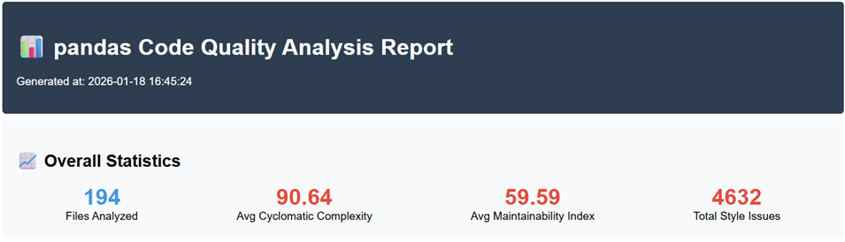
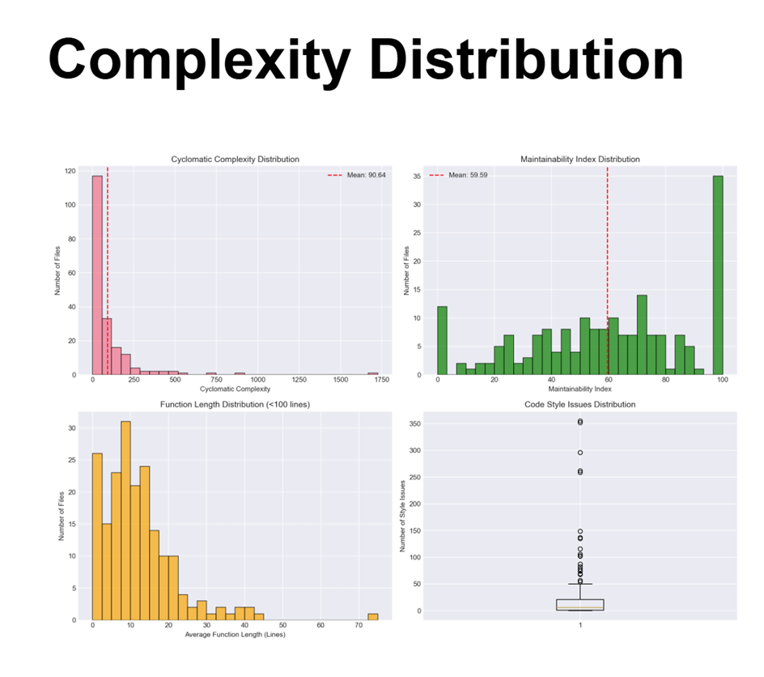
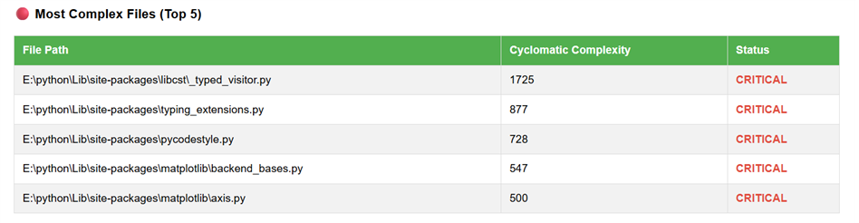
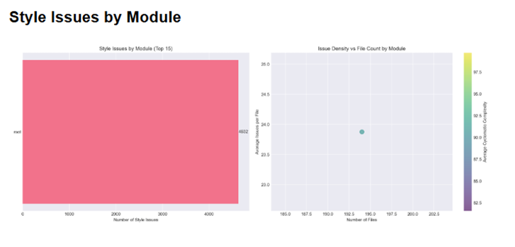
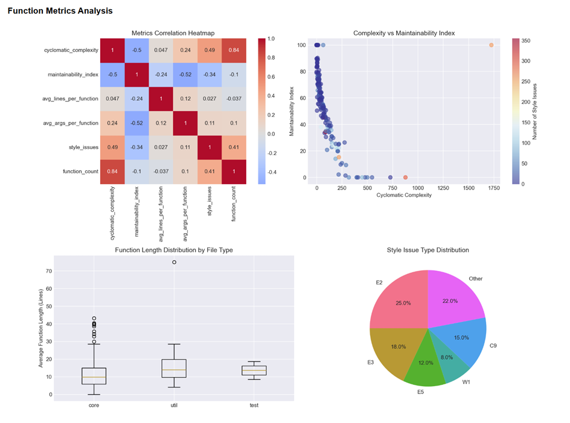
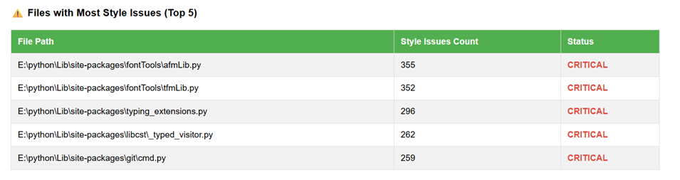
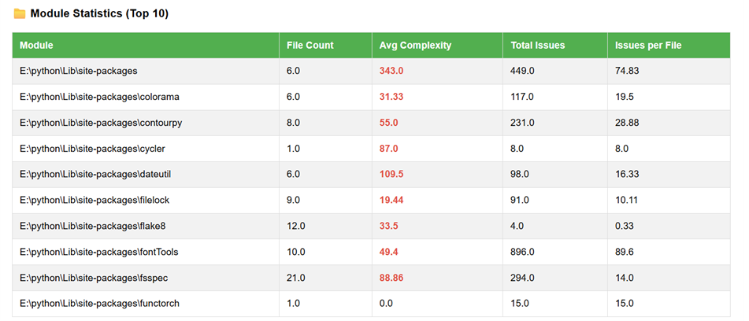
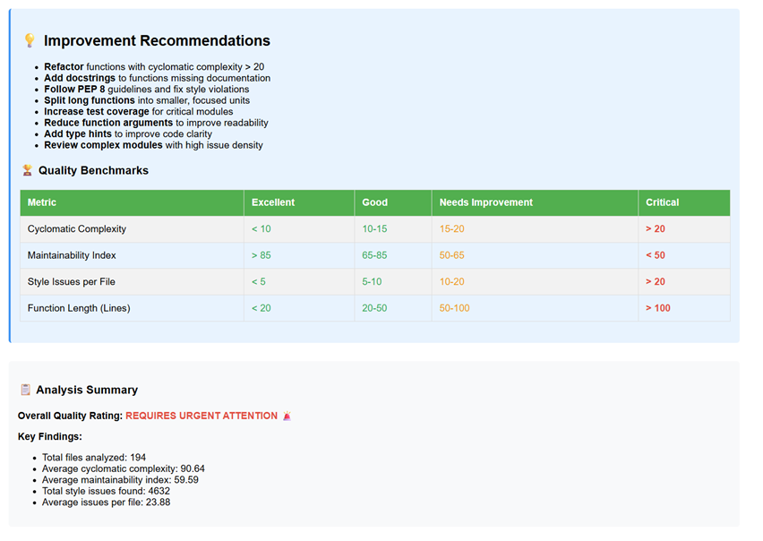

# 利用libcst、AST、radon等开源软件分析工具对pandas库进行分析


### 环境要求

libcst>=0.4.9

radon>=5.1.0
matplotlib>=3.5.0
plotly>=5.8.0
pandas>=1.4.0
jinja2>=3.0.0
flake8>=4.0.0
gitpython>=3.1.0
rich>=12.0.0
tqdm>=4.64.0

### 库安装命令

```cmd
pip install libcst>=0.4.9 radon>=5.1.0 matplotlib>=3.5.0 plotly>=5.8.0 pandas>=1.4.0 jinja2>=3.0.0 flake8>=4.0.0 gitpython>=3.1.0 rich>=12.0.0 tqdm>=4.64.0
```

### 运行结果截图

















